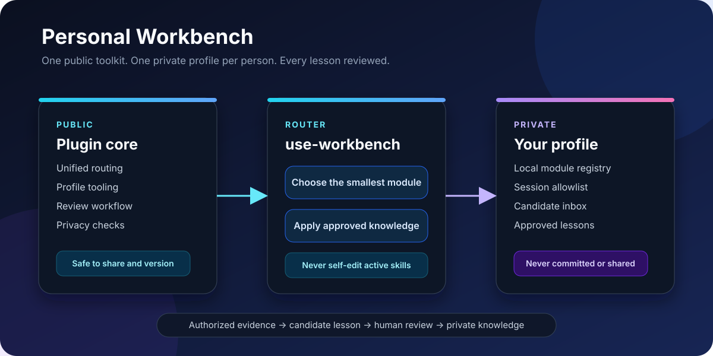

<p align="center">
  
</p>

<h1 align="center">Personal Workbench</h1>

<p align="center">
  A privacy-first Codex plugin that turns repeated work into reviewable skills—without mixing one person's history into another person's assistant.
</p>

<p align="center">
  <a href="#quick-start">Quick start</a> ·
  <a href="#privacy-model">Privacy model</a> ·
  <a href="#included-skills">Included skills</a> ·
  <a href="#中文说明">中文说明</a>
</p>

---

Personal Workbench gives Codex one clear entry point for modular work skills and a separate private profile for personal knowledge. Work evidence can become a candidate lesson, but it never becomes active behavior until its owner reviews and approves it.

## Why this exists

Useful work habits are usually scattered across prompts, local scripts, project notes, and chat history. Copying all of that into one large Skill creates three problems:

- irrelevant instructions consume context;
- personal or company details are easy to leak;
- automatic self-editing makes behavior hard to review or roll back.

Personal Workbench keeps these concerns separate:

| Layer | Contains | Shareable? |
| --- | --- | --- |
| Public plugin | Routing rules, profile tooling, review workflow, privacy checks | Yes |
| Private profile | Project paths, module registry, preferences, candidates, approved lessons | No |
| Session evidence | Explicitly authorized local work records | No |

## Included skills

| Skill | Purpose |
| --- | --- |
| [`use-workbench`](./skills/use-workbench/SKILL.md) | Route a request through the active profile and smallest relevant module |
| [`initialize-work-profile`](./skills/initialize-work-profile/SKILL.md) | Create an isolated profile with learning disabled |
| [`distill-work-experience`](./skills/distill-work-experience/SKILL.md) | Turn authorized evidence into sanitized candidates |
| [`review-experience-candidates`](./skills/review-experience-candidates/SKILL.md) | Approve, revise, reject, or defer proposed lessons |
| [`audit-workbench-privacy`](./skills/audit-workbench-privacy/SKILL.md) | Check public files before committing or sharing |

The repository itself is a Codex plugin. Additional domain-specific Skills stay where they already live and are referenced only by a private module registry.

## Quick start

Requirements: Python 3.10+ and Git.

```bash
git clone https://github.com/rzr002/personal-workbench.git
cd personal-workbench

python3 scripts/workbench.py init-profile \
  --name my_workbench \
  --root ~/.personal-workbench \
  --activate
```

The display name may contain underscores. The generated Codex Skill uses the normalized technical name `my-workbench`.

Check the active profile:

```bash
python3 scripts/workbench.py status --root ~/.personal-workbench
```

Every new profile starts with:

- `learning_mode: off`;
- an empty session allowlist;
- an empty private module registry;
- private candidate and approved-knowledge stores;
- a generated personal entry Skill.

## Connect a local skill

Register a local Skill by reference. Its absolute path is written only to the private profile:

```bash
python3 scripts/workbench.py add-module \
  --root ~/.personal-workbench \
  --name incident-diagnosis \
  --skill-path /path/to/local-skill \
  --description "Diagnose incidents from bounded local evidence" \
  --trigger "diagnose this incident"
```

The public plugin does not copy or publish that Skill.

## Controlled learning

Learning has two gates: candidate mode must be enabled, and the exact source session must be authorized.

```bash
python3 scripts/workbench.py set-learning \
  --root ~/.personal-workbench \
  --mode candidate

python3 scripts/workbench.py authorize-session \
  --root ~/.personal-workbench \
  --session-id SESSION_ID
```

Create a candidate—not an active rule:

```bash
python3 scripts/workbench.py add-candidate \
  --root ~/.personal-workbench \
  --source-session SESSION_ID \
  --title "Bound the evidence before diagnosing" \
  --lesson "Resolve the smallest relevant evidence window before drawing conclusions." \
  --confidence medium
```

Review it explicitly:

```bash
python3 scripts/workbench.py list-candidates --root ~/.personal-workbench

python3 scripts/workbench.py review-candidate \
  --root ~/.personal-workbench \
  --candidate CANDIDATE_ID \
  --decision approve
```

Approval updates only the private knowledge log. Updating a public Skill remains a normal Git change with tests, review, versioning, and rollback.

## Privacy model

Personal Workbench enforces a practical boundary:

1. Profiles live outside the cloned repository.
2. Learning defaults to off.
3. Exact session IDs must be allowlisted.
4. Archived prompts, logs, and tool output are treated as untrusted data.
5. Extracted lessons enter a candidate inbox, never an active Skill.
6. Human approval is required before private promotion.
7. Public promotion requires a separate code review and privacy scan.

Before publishing changes:

```bash
python3 scripts/privacy_scan.py .
python3 -m unittest discover -s tests -v
git diff --check
```

The scanner detects common secrets, credentials, private keys, personal identifiers, profile records, session records, and absolute user paths. Manual review is still required for confidential business context that does not match a pattern.

> **Shared-machine warning:** a profile name is not an access-control boundary. Use separate operating-system accounts or separate Codex session roots when users must not be able to read one another's data.

## Repository layout

```text
personal-workbench/
├── .codex-plugin/plugin.json
├── assets/architecture.svg
├── scripts/
│   ├── privacy_scan.py
│   └── workbench.py
├── skills/
│   ├── audit-workbench-privacy/
│   ├── distill-work-experience/
│   ├── initialize-work-profile/
│   ├── review-experience-candidates/
│   └── use-workbench/
└── tests/test_workbench.py
```

## Project status

This is an early privacy-first foundation. The current release provides deterministic profile isolation, private module registration, candidate review, secret redaction, and repository scanning. Automatic session collection and public-skill promotion remain deliberately out of scope until their ownership and validation boundaries are equally reliable.

## License

No open-source license has been selected yet. The source is public for inspection, but reuse terms should be chosen deliberately before broader distribution.

## 中文说明

Personal Workbench 是一个面向 Codex 的“个人工作台”：对外分享的是干净的通用插件，每个人自己的项目路径、工作偏好、本地 Skill、候选经验和已确认经验都保存在仓库之外。

核心原则很简单：

- 一个统一入口，内部按任务选择最小的 Skill；
- 新用户第一次使用时创建并命名自己的 Profile；
- 默认不学习，开启后也只生成候选经验；
- 候选经验必须由本人明确审核，不能自动修改正式 Skill；
- 同事使用时创建自己的 Profile，不会写入你的个人记录；
- 对外发布前必须通过隐私扫描、测试和 Git diff 检查。

第一次使用：

```bash
python3 scripts/workbench.py init-profile \
  --name my_workbench \
  --root ~/.personal-workbench \
  --activate
```

如果多人共用同一台机器或同一个系统账号，仅靠 Profile 名称无法实现真正的权限隔离；需要使用独立系统账号或独立的 Codex sessions root。
